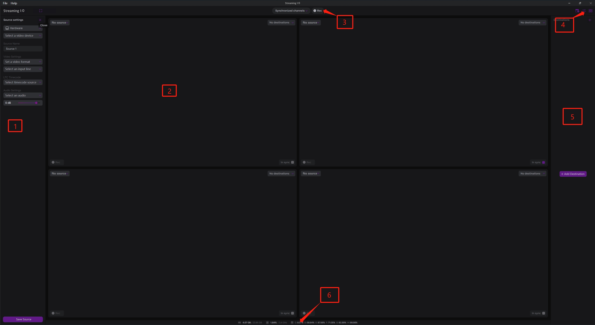

# Overview

Streaming I/O is multi-channel recording software that supports multiple input sources (SDI, NDI) along with Video Transport feeds and network streams and lots of encoding containers and codecs for your content.

Here is how Streaming I/O looks when you start it the first time:

Below you can find the parts of the interface:

1. List of Sources,
2. A single channel for preview and recording,
3. Synchronous recording controls,
4. Scheduling, Conversion settings, and View settings,
5. List of Destinations,
6. Performance counters to monitor the actual state of CPU, Memory, and disk use.

#### General workflow of Direct Take 

1. Configure one or multiple sources,
2. Сonfigure one or multiple destinations,
3. Сonfigure the channels to match what sources should be recorded to what destinations
4. Start the recording.&#x20;
5. _(Optionally) you can synchronize the required channels._
