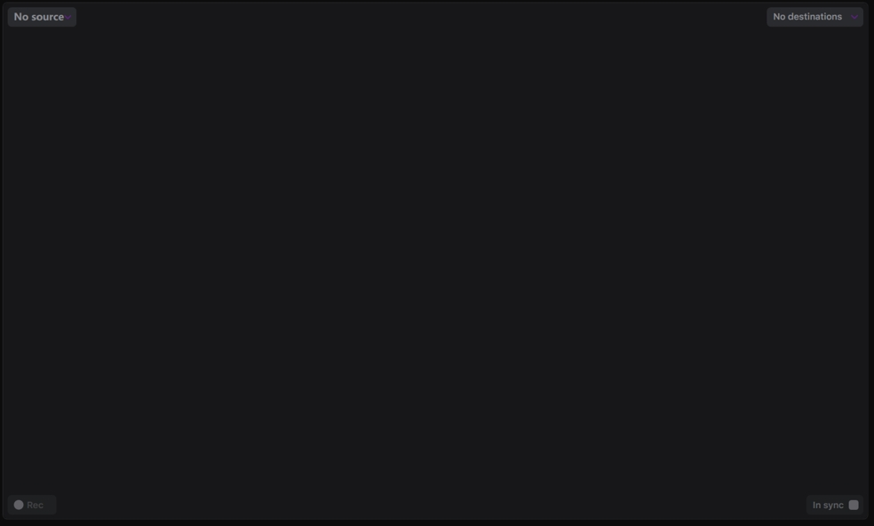

# Channels and Recording process

Channels are the preview panels of your sources where you can configure what source should be used, what destinations should be in use for recording, and control the recording process.

The default view of a channel is:

When you open the top-left list with sources, you can select the source for preview and further recording:

Once selected, you can see the video on a preview:

With the list of destinations on the top-right corner of a channel, you can choose what destinations should be used for recording:

If there are multiple destinations, you can select what options are required for the recording of the selected source.

You can enable the audio preview with the **Sound** button below the audio meters.

Once done, you can see, the Rec button is available, and you can start the recording.

Also, when recording is in progress, you can see what sources and what destinations are in use:

Control the recording with the **Pause** and the **Stop** buttons.

While the recording is in progress, you can monitor the process with the statistics panel. The available data is:

* Duration of the recording
* Current frame rate of the recording
* Number of breaks (no frame on the input)
* Number of drops (not enough performance to encode the video)
* Number of frames in a buffer

The **In sync** option is required for the synchronous recording.
