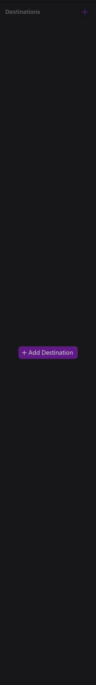
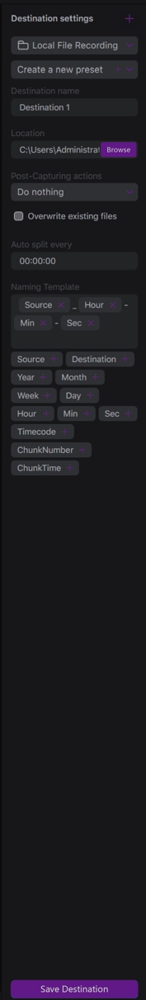
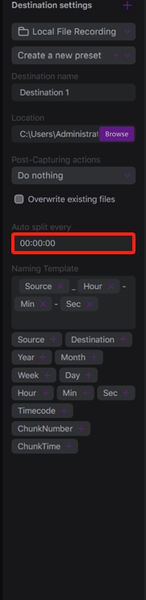
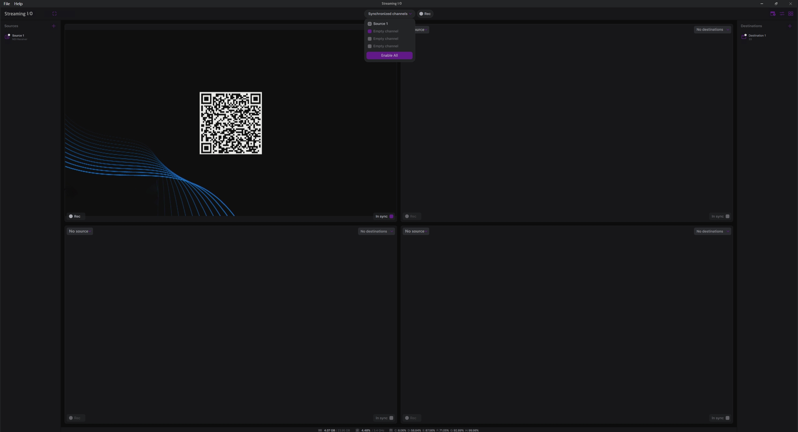
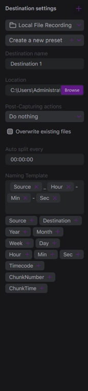

# Destinations

A destination is a configuration of how a source video should be recorded, should it be a network streaming or a local file recording.

The default view of the Destinations list is:

By clicking the Add Destination or the + button, you open the destination configuration menu:

First, you select the type of destination -- whether it is a local file recording or a network streaming.

#### Local File Recording

Next is the first list includes the encoding presets -- available configurations of the encoding (container, video codec, audio codec, additional parameters). This is covered in detail in the next chapter.

Next comes the destination name which you can see in the Destinations list.

With the **Location** field, you can set a root folder where the recorded files should be stored. Click the **Browse** button to open a file browser dialog.

You can define what to do with the recorded files -- to copy or to move the files to a specific folder. For this, you can use the **Post-Capturing actions** list.

With the **Auto split every** field, you set a split interval for recording in HH:mm:ss format. For example, to split the recording in 30 minutes chunks, you should set _00:30:00_ in the field.

With the **Naming Template**, you can set the template of how the resulting files should be named.

Possible options for the template:

* _Source_ -- use the source name, e.g. "Source 1"
* _Destination_ -- use the destination name, e.g. "Destination1"
* _Year/Month/Week/Day/Hour/Min/Sec_ -- use the current date and time as parts of the resulting filename
* _Timecode_ -- use a timecode of the first frame being recorded.
* _ChunkNumber_ -- if you use the auto-split feature, use an index of a chunk as a part of the resulting filename
* _ChunkTime_ -- if you use the auto-split feature, use the time of switching between the chunks as a part of the resulting filename.

By clicking on the buttons below the Naming Template field, you can add new parts to the template. You can type extra symbols between the parts in the field. For example, with the above template, you will have files with names like "_Source 1\_10-08-15.mp4_". You can create subfolders by using '\\' symbols between the placeholders to organize the recordings.

Click the Save Destination button to add the destination to the Destinations list. If you like to cancel the process, you can click the X button at the top-right corner of the Destination Settings menu.

Here is an example of the configuration:

Once you have saved the destination, you can find it in the Destinations list:

To edit the destination, click the Edit button:

.png>)

By this, you open the destination settings menu:

You can change the parameters and click the Save Destination button to apply the changes. Click the X button at the top-right corner to cancel the changes. To remove the destination, click the trash bin button.

#### Network Streaming

This type of destination is for streaming. You can use it for YouTube or Twitch streaming, for UDP or SRT point-to-point streaming, and others.

Set the **Target URL** with an address of your server with an optional field for the **Stream key** to set up the streaming destination. The presets are independent of the ones created for the Local File Recording option.
