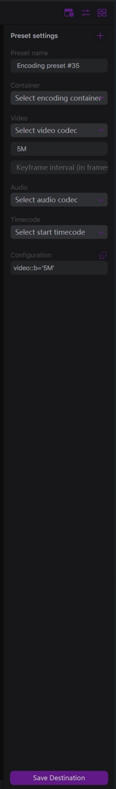

# Encoding presets

The encoding preset is a set of parameters of how the video should be encoded -- container, video and audio codecs, additional parameters.

When you configure a destination, you can select one of the available presets or create a new one:

If the "_Create a new preset_" is selected, you can add a new one by clicking the **+** button. For the existing presets, you can open the configuration menu with the edit button:

Here is how the preset settings look like:

You should set the name of the preset with the **Preset name** field.

**Container** list contains available file format for recording:

Different containers support different sets of available video and audio codecs. So you should choose the Container first. Once the container is set, you can set the video and audio codecs.

The Video contains a list of available video codecs:

Below there are fields for **Bitrate** and the **Keyframe interval**.

The bitrate is set in formats of Mb or kb. For example, "_15M_" or "_2500K_".

The keyframe interval is set in frame units. For example, "_60_" means to have one keyframe on 60 processed frames. So for 30 fps input, this results in a 2-seconds keyframe interval, and for 60 fps input, it is a 1-second interval.

The Audio contains available audio sources:

**Timecode** lists the possible start timecode options:

* Use embedded timecode -- if a source contains embedded timecode data, the start timecode of the resulting files matches the timecode of the source. For example, if you have an SDI input with embedded timecode, the resulting files will have the start timecode value that matches the timecode from this SDI source.
* Use the system time -- use the local time of your machine as the start timecode value for the resulting files.
* Manual timecode -- set the timecode manually in _hh:mm:ss:ff_ format
* Don't use timecode -- timecode is disabled in the resulting files.

**Configuration** field presents the resulting encoding configuration. It is updated when you change the above parameters, but you can type the configuration manually. Contact our support team to get a configuration for the desired results.

You can copy the configuration to the clipboard with the top-right button to share it with your teammates or with Livemix support engineers.

Here is how the configuration might look like:

Click the Save Preset button to add the preset to the available Encoding Presets list:

To edit the preset, click the Edit button:

By this, you open the Preset settings menu:

You can change the preset parameters and apply the changes by clicking the Save Preset button. To cancel the changes, click the X button. To remove the preset, click the trash bin button.

Note please that for the Network Streaming type the presets include the streaming protocols as available **Container** options:

