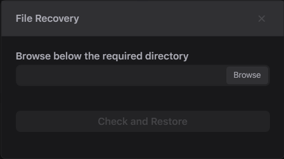
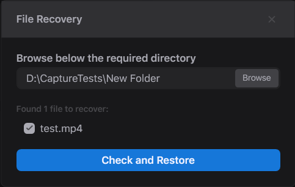
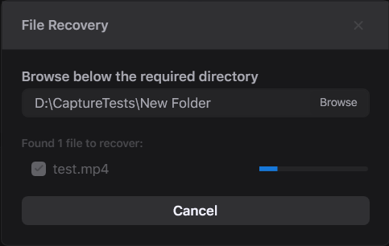

# File Recovery

There is a redundancy mechanism in Streaming I/O with which you can restore the recording videos if the software crashes, there is a power outage, or the system faces other hardware-related crashes. The mechanism is File Recovery. You can find it with File -> File Recovery:

<figure><figcaption></figcaption></figure>

Select a target folder with the **Browse** button. Streaming I/O checks the selected folder for any corrupted recordings, and if there are any it returns you a list:

<figure><figcaption></figcaption></figure>

Select the required files, and click the **Check and Restore** button to recover the recordings:

<figure><figcaption></figcaption></figure>

Once the process is finished, you have a message that informs you about the number of recovered files. The original files remain unchanged, and you can find the recovered files which names are marked with the "_\_Recivered_" suffix following with the time of the recovery operation in the same folder. For example, "_test\_Recovered\_09\_57\_15.mp4_".
