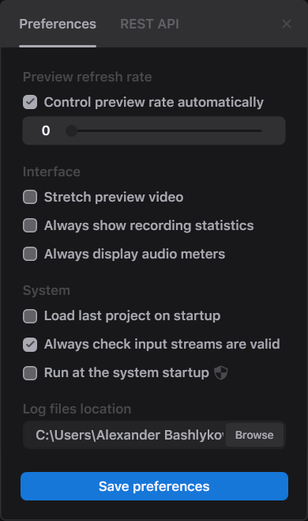

# Preferences

With the Preferences menu, you can change the behavior of Direct Take. You can open the Preferences menu with File -> Preferences:

<figure><figcaption></figcaption></figure>

* _Preview refresh rate_ -- sets a frequency of preview updates. 0 means full rate, the higher value is the less often the preview is updated.
* _Adjust preview rate automatically_ -- change the preview rate automatically depending on the current CPU usage.
* _Stretch preview video_ -- once enabled, the video on a preview is stretched to fill the preview control. Otherwise, the preview maintains the original aspect ratio.
* _Always show recording statistics_ -- once enabled, the recording statistics is displayed on preview always while the recording is in progress.
* _Always display audio meters_ -- once enabled, the audio meters are displayed on preview always. Otherwise, you can check the audio meters only when you hover over the preview control.
* _Load last project on startup_ -- once enabled, Direct Take loads the last configuration when you start the application.
* _Always check input streams are valid_ -- when you open a network stream as a source, Direct Take checks if the stream is available before processing it. Otherwise, the stream is loading asynchronously.
* _Run at the system startup_ -- once enabled, Direct Take starts with the system startup.
* _Log files location_ -- a folder where Direct Take stores its logs with information of sources, destinations, channels, and all the properties in use.

The REST API tab is covered in separate documentation.

Click the **Save preferences** button to apply the changes or close the menu to cancel the changes.
