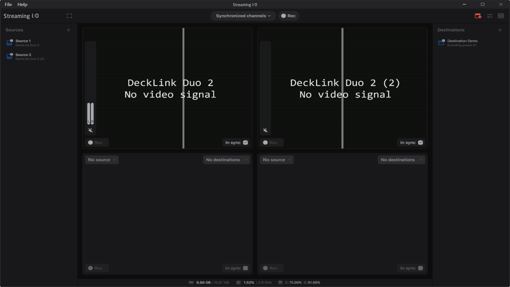

# Scheduling

You can plan the recording with the scheduling feature. Click the **Schedule** button to open the settings:

You can set the start time and the stop time for the recording as well as the type of scheduling with the "Channels" list:

* In Sync only -- with this option, only the "In Sync" channels start/stop the recording at the specified time;
* All channels -- with this option, all the channels that are configured for recording, start/stop the recording at the specified time.

Click the **Schedule** button to apply the settings:

