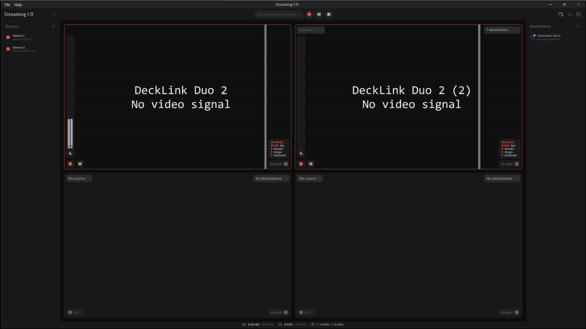
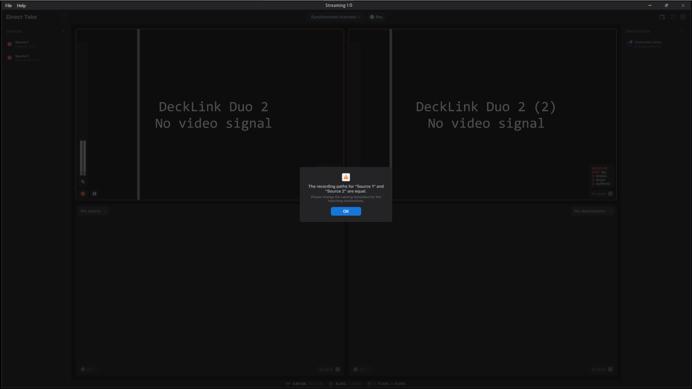

# Synchronous recording

To synchronize the recordings, you can enable the **In sync** option on the required channels. Or you can open the **Synchronized channels** list and select the channels:

<figure><figcaption></figcaption></figure>

Once you've done this, you can start the synchronous recording by clicking the **Rec** button next to the **Synchronized channels** list:

<figure><figcaption></figcaption></figure>

Note that all the selected channels should be configured for the recording before you start the process. It means that the channels should have at least one destination selected and the naming templates should generate unique filenames, and the sources should be of the same frame rate. If the sources don't match each other by the input frame rate, you can enable the conversion with the Conversion settings. If some of the conditions aren't OK, Direct Take shows you a warning message:

<figure><figcaption></figcaption></figure>
